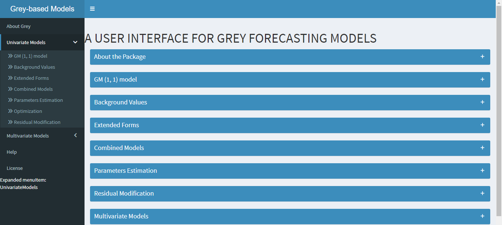
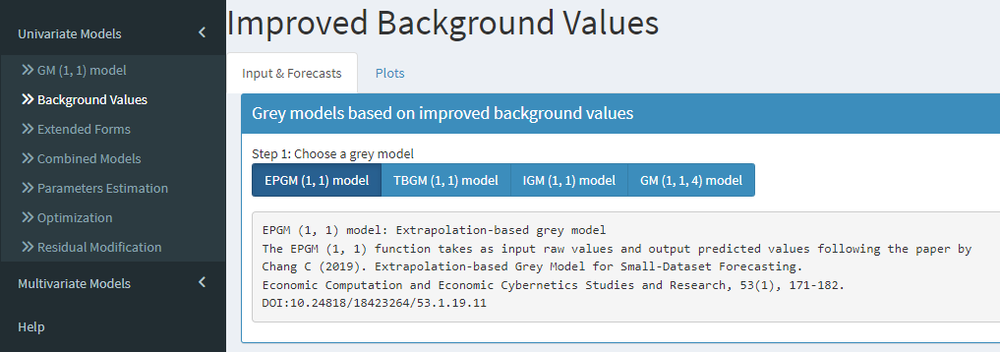
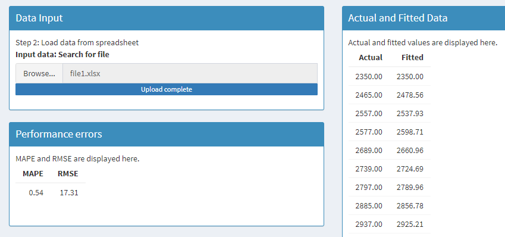
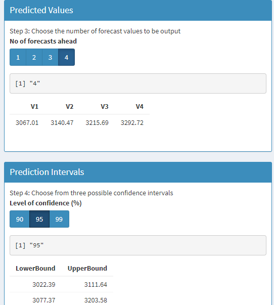
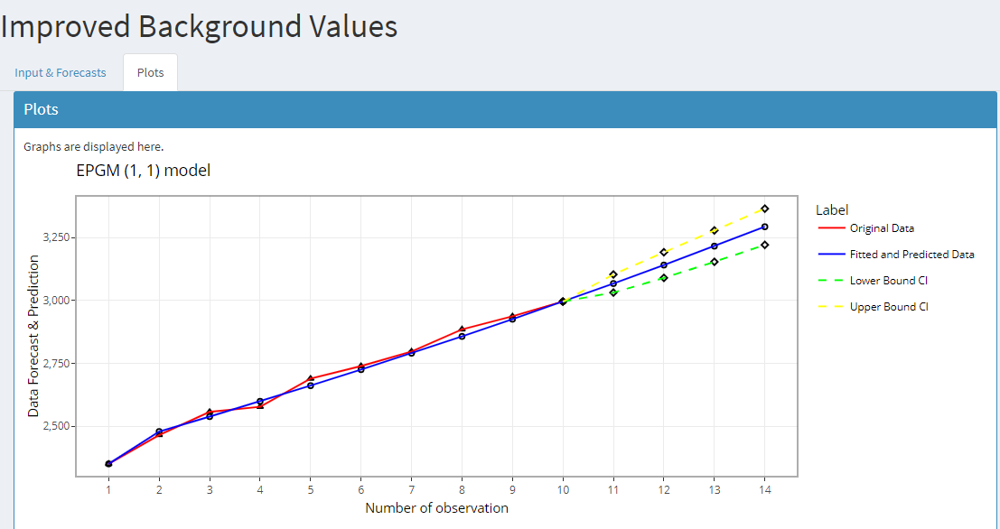

# Summary

`Greymodels` is a Shiny [@Chang2021] application for statistical modelling and forecasting using grey-based models. It covers several state of-the-art univariate and multivariate grey models. A user friendly interface allows users to easily compare the performance of different models for prediction and among others, visualize graphical plots of predicted values within user chosen confidence intervals.

# Statement of need

With the world striving to achieve unprecedented economic and social heights, risks and uncertainties are increasingly common leading to decision makers needing to be well informed prior to any undertakings. 

Traditionally, explanatory models have been employed and they give good forecasts if the explanatory variables are known and properly modelled. The models also usually require prior assumption on the distribution of the data. One approach that has conventionally been employed is Regression. However, it has the added limitation that most of its variations depends upon means which make the model prone to outliers. Also, with the evolution of risk variables, we may easily remain short of holistically defining all causal variables of interest. Time series approaches on the other hand, have also commonly been employed, since they are considered as black box approaches and would require no explicit formalisation of the explanatories. However, these models require at least forty historical observations for a valid calibration of the model [@Tao2011] and in many practical instances, there may have insufficient historical data or poor information available.

To ease accessibility of time series based-statistical modelling approaches to practitioners, several forecasting packages have been proposed in the literature. For instance, the fable package [@Hyndman2019] provides a collection of univariate and multivariate time series forecasting models including exponential smoothing via state space models and automatic ARIMA models. These models work within the fable framework, which provides the tools to evaluate, visualise, and combine models in a workflow consistent with the the package tidyverse [@Wickham2021]. Another forecasting package is the prophet package [@Letham2021] which forecast time series data based on an additive model, where non-linear trends are fit with yearly, weekly, and daily seasonality, plus holiday effects. The package works best with time series data that have strong seasonal effects and several seasons of historical data. 

Practically, modelling approaches are often limited by unavailability of sufficient data or the requirement of some underlying statistical distribution properties in the data. Grey models however are able to deal with data with no prior assumption on the statistical distribution, as well as small or incomplete datasets.

We propose the `Greymodels` app and to the best of our knowledge no package implementing grey models is available.

Greymodels presents to the user, several grey models that cater for different data types and easily allows for predicting the short-term developing trend of a data sequence. Designed with ease of use in mind, `Greymodels` is intended for practitioners across all disciplines to easily harness the potential of efficient forecasting of grey models.

# Overview

Users can install the package in their local R directory and run the Shiny app through the command-line interface. The package uses the shinydashboard layout to display the interface of the package which includes both univariate and multivariate grey models for forecasting, as shown in Figure 1. 

Under the Univariate Models tab, besides the **GM (1, 1) model**, the models are divided into six categories namely **Background Values**, **Extended Forms**, **Combined Models**, **Parameters Estimation**, **Optimization** and **Residual Modification**. Under each category, the user is provided with several implementations.

The **About Grey** tab explains the use of the package and the different models implemented. The **Multivariate Models** tab, as the name suggests, regroups multivariate sequences and interval multivariate sequences. The inbuilt models may be accessed through different widgets, for instance radio buttons and checkbox group. 

 Figure 1: The dashboard of the Greymodels package. 

The **Background Values** tab contains four models function namely extrapolation-based grey model (EPGM (1, 1) model) [@Changche2019], data transformation-based grey model (TBGM (1, 1) model) [@Kai2019], improved grey model (IGM (1, 1) model) [@Slo2012] and grey model with four background values (GM (1, 1, 4) model) [@Shuliang2019]. The package allows for comparison of the different grey models under a particular category (see Figure 2). 

 Figure 2: An excerpt of the models under improved background values of grey models. 

The `Greymodels` package loads data from spreadsheets and each model accepts a set of data and outputs the fitted and predicted values. For instance, to load data and model it using the EPGM (1, 1) model, we follow

Univariate Models $\rightarrow$ Background Values $\rightarrow$ EPGM (1, 1) model $\rightarrow$ Data Input

Performance accuracies of each model are evaluated using the mean absolute percentage error (MAPE) and the root mean square error (RMSE). Each category is provided with two tabs namely the **Input & Forecasts** tab and the **Plots tab**. Figure 3 shows an excerpt of the data input, fitted and predicted values and performance errors of the EPGM (1, 1) model. 

 Figure 3: An excerpt of the data input and output of the EPGM (1, 1) model. 

The user has the possibility to choose the number of forecast values to be output. The cap number of forecasts has been set to four since small sets of historical data are conventionally used in the grey model training. The user also has the choice to choose the level of confidence for the predicted values. Fiure 4 shows an excerpt of the predicted values and a 95% confidence interval of the forecast values obtained from the EPGM (1, 1) model.

 Figure 4: An excerpt of the predicted values and confidence interval of the EPGM (1, 1) model. 

The **Plots** tab displays an interactive plot which can be saved in Portable Network Graphics (png) directly from the interface. The plot enables the user to perform actions such as zoomimg as well as hovering over the plot to view the coordinates at a particular point of interest. Figure 5 shows a plot of the EPGM (1, 1) model.

 Figure 5: An excerpt of the interactive plot of the EPGM (1, 1) model. 

# Models' Summary

| Model name | Paper | Categorised in GUI under tab |
| --------------- | --------------- | --------------- |
| GM (1, 1) | [@Deng1982] | GM (1, 1) model |
| EPGM (1, 1) | [@Changche2019] | Background Values |
| TBGM (1, 1) | [@Kai2019] | Background Values |
| IGM (1, 1) | [@Slo2012] | Background Values |
| GM (1, 1, 4) | [@Shuliang2019] | Background Values |
| DGM (1, 1) | [@naiming2009] | Extended Forms |
| DGM (2, 1) & ODGM (2, 1) | [@Yis2012] | Extended Forms |
| NDGM (1, 1) | [@naiming2013] | Extended Forms |
| VSSGM (1, 1) | [@miao2020] | Extended Forms |
| GOM (1, 1) | [@Zhu2016] | Extended Forms |
| GOM_IA (1, 1) | [@Xiaoyi2013] | Extended Forms |
| GOM (1, 1) | [@Youxin2012] | Extended Forms |
| EXGM (1, 1) | [@Halis2020] | Extended Forms |
| EGM (1, 1) | [@Der2011] | Extended Forms |
| NGBM (1, 1) | [@Chen2008] | Combined Models |
| GGVM (1, 1) | [@Weijie2020] | Combined Models |
| TFDGM (1, 1) | [@Xxiao2020] | Combined Models |
| SOGM (1, 1) | [@Ningxu2015] | Parameters Estimation |
| NGM & ONGM | [@Pengyu2014] | Parameters Estimation |
| PSO-GM (1, 1) | - | Optimization |
| EGM (1, 1, r) | [@Bozeng2019] | Optimization |
| ANDGM (1, 1) | [@Lianyi2021] | Optimization |
| Remnant GM (1, 1) | [@Huy2020] | Residual Modification |
| TGM (1, 1) | [@Zhou2006] | Residual Modification | 
| GM (1, 3) & IGM (1, 3) | [@Maolin2020] | Multivariate Sequences |
| NHMGM_p (1, 2) | [@Hwang2019] | Multivariate Sequences |
| GMC & GMC_g (1, 2) | [@Songd2020] | Multivariate Sequences |
| DBGM (1, 2) | [@Bo2018] | Multivariate Sequences |
| IG-NDGM (1, 2) | [@Naiming2015] | Multivariate Interval Sequence |
| MDBGM (1, 2) | [@Xiangyan2019] | Multivariate Interval Sequence |

# Acknowledgments

Thanks to the HEC Mauritius

# References
	
